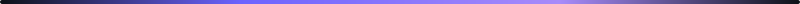

<a href="https://www.linkedin.com/in/polta/">
  <div align="center">
    
  </div>
</a>

<div align="center">

[](https://www.linkedin.com/in/polta/)

[](https://www.linkedin.com/in/polta/)
[](mailto:apoltavtseef@gmail.com?subject=Project%20Inquiry%20-%20Found%20you%20on%20GitHub&body=Hi%20Amaury%2C%0A%0AI%20found%20your%20GitHub%20profile%20and%20I%E2%80%99d%20like%20to%20discuss%20a%20project.%0A%0AHere%E2%80%99s%20a%20brief%20overview%3A%0A-%20Project%20type%3A%20%0A-%20Timeline%3A%20%0A-%20Budget%20range%3A%20%0A%0ALooking%20forward%20to%20hearing%20from%20you!)

</div>

<br/>

<a href="https://www.linkedin.com/in/polta/"></a>

<br/>

## About Me

```yaml
# amaury.yml - do not edit in production (I'm already running)
# TODO: mass sleep  # has been in the backlog since 2021

name: Amaury Poltavtseef
location: Paris, France
role: Freelance Full-Stack & Mobile Developer
education: Epitech, MSc Computer Science (2018-2023)

focus: |
  I take entire products from first commit to production, alone.
  Mobile app, API, admin panel, infrastructure - one dev, full ownership.

fun_facts:
  - Started coding at 13 by reverse-engineering Call of Duty on PS3
  - Ran top 2 French Garry's Mod servers before turning 18
  - Mass-texts friends to beta test every new app
  - Has deployed more Dockerfiles than cooked meals
  - If you're reading the YAML, you're probably a dev. Hi.

availability: open  # let's talk
```

I'm the developer founders call when their agency couldn't deliver. One client spent **50,000 euros** on an agency - product was unusable. I rebuilt it solo: 88 screens, 32 languages, real-time chat, Stripe Connect. That's how I operate. One dev, zero excuses.

- Currently building: AI-powered SaaS products
- Currently learning: always something new, currently deep in [Claude Agent SDK](https://docs.anthropic.com/en/docs/agents-and-tools/claude-code/sdk)
- Currently listening to: way too much [lo-fi](https://www.youtube.com/watch?v=jfKfPfyJRdk) while deploying at 2am

<br/>


<br/>

## Tech Stack

<div align="center">

**Mobile & Frontend**

<a href="https://flutter.dev"></a>
<a href="https://dart.dev"></a>
<a href="https://react.dev"></a>
<a href="https://nextjs.org"></a>
<a href="https://www.typescriptlang.org"></a>
<a href="https://tailwindcss.com"></a>

**Backend & Data**

<a href="https://nestjs.com"></a>
<a href="https://nodejs.org"></a>
<a href="https://go.dev"></a>
<a href="https://expressjs.com"></a>
<a href="https://www.prisma.io"></a>
<a href="https://www.postgresql.org"></a>
<a href="https://redis.io"></a>
<a href="https://www.mongodb.com"></a>

**DevOps & Tools**

<a href="https://www.docker.com"></a>
<a href="https://www.ansible.com"></a>
<a href="https://nginx.org"></a>
<a href="https://www.cloudflare.com"></a>
<a href="https://github.com/Asteerix"></a>
<a href="https://github.com/features/actions"></a>
<a href="https://www.linux.org"></a>
<a href="https://www.figma.com"></a>

**AI**

[](https://www.anthropic.com)
[](https://openai.com)

</div>

<br/>


<br/>

## Featured Projects

<table>
<tr>
<td width="50%" valign="top">

<h3><a href="https://github.com/2gather-nyxus">2gather</a></h3>

**Social events & dating platform**

<p>
  <a href="https://flutter.dev"></a>
  <a href="https://nestjs.com"></a>
  <a href="https://www.postgresql.org"></a>
  <a href="https://redis.io"></a>
  <a href="https://stripe.com"></a>
</p>

Rebuilt from a failed agency project. 88 screens, 32 languages, real-time matching and messaging, Stripe Connect payments, university verification with OCR and facial recognition. Full admin panel with analytics. Ansible + Docker infrastructure with Prometheus/Grafana monitoring.

</td>
<td width="50%" valign="top">

<h3><a href="https://www.prefecturedepolice.interieur.gouv.fr">Police Prefecture</a></h3>

**3 national government platforms**

<p>
  <a href="https://symfony.com"></a>
  <a href="https://vuejs.org"></a>
  <a href="https://www.postgresql.org"></a>
  <a href="https://www.docker.com"></a>
  <a href="https://www.ansible.com"></a>
</p>

2 years 9 months on-site. Police cadet assignments across 20+ academies, aerial permits management, road works tracking. Replaced a legacy Access 98 system. SAML SSO, GDPR compliance. Processing time cut by 3x.

</td>
</tr>

<tr>
<td width="50%" valign="top">

<h3><a href="https://github.com/klarvon">Klarvon</a></h3>

**AI-powered strategic intelligence SaaS**

<p>
  <a href="https://nextjs.org"></a>
  <a href="https://www.anthropic.com"></a>
  <a href="https://www.prisma.io"></a>
  <a href="https://www.postgresql.org"></a>
  <a href="https://stripe.com"></a>
</p>

Enter a company name, receive a full strategic report within 24 hours. AI agents analyze market sizing, competition, and positioning across 12 business frameworks. Interactive dashboards, AI chat on results, tiered Stripe subscriptions.

</td>
<td width="50%" valign="top">

<h3><a href="https://www.tradegenius.com">TradeGenius</a></h3>

**Crypto DEX trading platform**

<p>
  <a href="https://nextjs.org"></a>
  <a href="https://react.dev"></a>
  <a href="https://www.typescriptlang.org"></a>
  <a href="https://tailwindcss.com"></a>
</p>

Frontend reinforcement for a US-based crypto decentralized exchange. Real-time trading charts, advanced datatables, animated reward wheel system, gain modals with GIF-to-video conversion, distributed wallet system for order execution.

[](https://www.tradegenius.com)

</td>
</tr>

<tr>
<td width="50%" valign="top">

<h3><a href="https://github.com/afreecab">Afreecab</a></h3>

**Ride-hailing service**

<p>
  <a href="https://flutter.dev"></a>
  <a href="https://nestjs.com"></a>
  <a href="https://react.dev"></a>
  <a href="https://stripe.com"></a>
  <a href="https://www.docker.com"></a>
</p>

Complete platform - API, mobile app, and admin panel. Dynamic pricing across 9 Paris zones, dual payment gateway (EUR + XOF + cash), real-time driver dispatch and GPS tracking, self-hosted OSRM routing, SMS/WhatsApp notifications.

</td>
<td width="50%" valign="top">

<h3><a href="https://github.com/genie-gifts">Genie</a></h3>

**Collaborative gift & event app**

<p>
  <a href="https://flutter.dev"></a>
  <a href="https://go.dev"></a>
  <a href="https://www.mongodb.com"></a>
  <a href="https://redis.io"></a>
  <a href="https://opensearch.org"></a>
</p>

20 months solo. Custom avatar engine built from scratch with layered SVG compositing. Collaborative wishlists, group funding pools, WebSocket messaging, affiliate product search, managed children accounts with parental controls.

</td>
</tr>

<tr>
<td width="50%" valign="top">

<h3><a href="https://github.com/thot-app">Thot</a></h3>

**Social network for journalists**

<p>
  <a href="https://flutter.dev"></a>
  <a href="https://nestjs.com"></a>
  <a href="https://www.postgresql.org"></a>
  <a href="https://www.mongodb.com"></a>
  <a href="https://ffmpeg.org"></a>
</p>

13 months solo. Multimedia content platform - articles, long videos, shorts, podcasts. FFmpeg compression with HLS streaming, built-in photo/video capture with editing and cropping. Ready for App Store and Play Store.

</td>
<td width="50%" valign="top">

<h3><a href="https://github.com/arte-noir-digital">FuturMed</a></h3>

**Medical platform for nursing homes**

<p>
  <a href="https://nextjs.org"></a>
  <a href="https://www.prisma.io"></a>
  <a href="https://www.postgresql.org"></a>
  <a href="https://resend.com"></a>
</p>

Medical coordination platform for EHPAD nursing homes. Complete resident management, tabbed consultation workflow, rule-based diagnostic engine (symptoms to diagnoses), AI clinical assistant, notifications, CSV/PDF export.

</td>
</tr>
</table>

<br/>

<details>
<summary><b>A few more</b></summary>

<br/>

| Project | What I built |
|---------|-------------|
| [**TV Media Show**](https://github.com/AppFlavors) | Digital signage SaaS - WebRTC live preview, 6 screen pairing methods, Stripe billing tiers. `Express` `React` `Socket.IO` |
| [**Cryptobot**](https://github.com/agence-and-co) | Crypto analytics platform - ML-powered trading signals, ETL from Binance/CoinGecko, Streamlit dashboards. `Python` `FastAPI` `TimescaleDB` |
| [**&Friends**](https://github.com/and-friends) | Social events app - real-time chat, stories, interactive map, contact matching. `React Native` `Expo` `Supabase` |
| [**Enlarge.fr**](https://github.com/arte-noir-digital) | Floating cultural bar website - GSAP + Lenis scroll animations, Stripe lottery system, 5 languages. `Next.js` `GSAP` `Prisma` |
| [**Roamline**](https://github.com/polta-apps) | Travel journal app - calendar sync, NLP trip parser, Schengen day calculator, annual heatmaps. `Flutter` `Riverpod` `Hive` |
| [**Cosmic Tap Ascension**](https://github.com/polta-apps) | Space idle game - prestige system, achievements, Game Center leaderboards, 12 languages. `Flutter` `Riverpod` |
| [**AppFlavors**](https://github.com/AppFlavors) | 12+ client websites for studios, bars, associations, portfolios. `Next.js` `React` `Go` |

</details>

<br/>


<br/>

## The Story

> [**~2013**](https://en.wikipedia.org/wiki/Call_of_Duty:_Black_Ops_II) - Jailbroke a PS3. Modded Call of Duty with GSC scripting and CCAPI memory manipulation. Got hooked on *"how does this actually work?"*
>
> [**2013-2020**](https://gmod.facepunch.com) - Ran Garry's Mod community servers. PHP webstore, XenForo forums, DDoS protection. 70+ concurrent players, top 2 French servers.
>
> [**2018**](https://www.epitech.eu) - Entered Epitech. 130 projects across 5 years. Won a national game jam. Specialized in cybersecurity.
>
> [**2019**](https://www.banque-france.fr) - Bank of France internship. ASP.NET MVC, Oracle DB. Enterprise rigor acquired.
>
> [**2021-2023**](https://www.prefecturedepolice.interieur.gouv.fr) - Paris Police Prefecture, 2.5 years on-site. 3 national platforms, 20+ academies. Processing time cut by 3x.
>
> **2023** - Went freelance. Shipped the first product solo. Then the second. Then lost count.
>
> **Now** - Still shipping. Still solo. Still mass-texting friends to beta test. Still mass-deploying Dockerfiles at 2am.

<br/>


<br/>

<div align="center">

**Got a product to build, or one someone else couldn't finish?**

[](https://www.linkedin.com/in/polta/)
[](mailto:apoltavtseef@gmail.com?subject=Project%20Inquiry%20-%20Found%20you%20on%20GitHub&body=Hi%20Amaury%2C%0A%0AI%20found%20your%20GitHub%20profile%20and%20I%E2%80%99d%20like%20to%20discuss%20a%20project.%0A%0AHere%E2%80%99s%20a%20brief%20overview%3A%0A-%20Project%20type%3A%20%0A-%20Timeline%3A%20%0A-%20Budget%20range%3A%20%0A%0ALooking%20forward%20to%20hearing%20from%20you!)

<br/>

<picture>
  <source media="(prefers-color-scheme: dark)" srcset="https://raw.githubusercontent.com/Asteerix/Asteerix/output/github-snake-dark.svg" />
  <source media="(prefers-color-scheme: light)" srcset="https://raw.githubusercontent.com/Asteerix/Asteerix/output/github-snake.svg" />
  
</picture>

</div>

<br/>

<a href="https://www.linkedin.com/in/polta/">


</a>

<!-- If you're reading the source, you found the second easter egg. The first one is in the YAML. Buy me a mass coffee: mass caffeine is what mass ships mass products. -->
