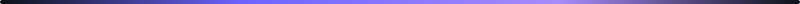

<a href="https://www.linkedin.com/in/polta/">
  <div align="center">
    
  </div>
</a>

<div align="center">

[](https://www.linkedin.com/in/polta/)

[](https://www.linkedin.com/in/polta/)
[](mailto:apoltavtseef@gmail.com?subject=Project%20inquiry)

</div>

<br/>



<br/>

## About me

```yaml
name: Amaury Poltavtseef
role: Flutter and Full-Stack Developer, freelance since Oct. 2023 (AppFlavors)
experience: 5 years of software in production, 4 of Flutter
location: Paris, France (CET), remote or hybrid
education: Epitech Paris, Expert in Information Technology (Master's level), 2018 to 2023
languages: French (native), English (fluent)
availability: now
```

iOS and Android apps delivered end to end, two of them live on the stores, with their API and their infrastructure: Flutter on the client, NestJS on PostgreSQL behind, Docker and Ansible underneath. Used to demanding environments: Paris Police Prefecture, Banque de France, sensitive data and GDPR.

Two of those apps were rescues. Sinao was a Flutter invoicing app poorly delivered by someone else: architecture overhaul, critical bug fixes, then both stores. 2gather was a social events platform rebuilt from scratch after an agency's failed attempt: Flutter app, NestJS API, Docker and Ansible infrastructure, and a load test validated by an external audit at 25,000 active users.

- Currently building: Klarvon, a strategic intelligence SaaS in Next.js with Claude agents and Stripe subscriptions
- Daily tooling: Claude agents in the development workflow

<br/>


<br/>

## Tech stack

<div align="center">

**Mobile and front-end**

<a href="https://flutter.dev"></a>
<a href="https://dart.dev"></a>
<a href="https://react.dev"></a>
<a href="https://nextjs.org"></a>
<a href="https://vuejs.org"></a>
<a href="https://www.typescriptlang.org"></a>
<a href="https://tailwindcss.com"></a>

**Back-end and data**

<a href="https://nestjs.com"></a>
<a href="https://nodejs.org"></a>
<a href="https://www.prisma.io"></a>
<a href="https://www.postgresql.org"></a>
<a href="https://redis.io"></a>
<a href="https://www.mongodb.com"></a>
<a href="https://www.mysql.com"></a>
<a href="https://symfony.com"></a>
<a href="https://www.php.net"></a>
<a href="https://go.dev"></a>
<a href="https://dotnet.microsoft.com"></a>
<a href="https://dotnet.microsoft.com"></a>

**Services, security and DevOps**

<a href="https://stripe.com"></a>
<a href="https://firebase.google.com"></a>
<a href="https://www.twilio.com"></a>
<a href="https://aws.amazon.com/s3/"></a>
<a href="https://www.docker.com"></a>
<a href="https://www.ansible.com"></a>
<a href="https://www.ovhcloud.com"></a>
<a href="https://nginx.org"></a>
<a href="https://github.com/features/actions"></a>
<a href="https://about.gitlab.com"></a>
<a href="https://sentry.io"></a>
<a href="https://www.linux.org"></a>

JWT, OAuth2, SAML and LDAP SSO, two-factor authentication, roles and permissions, GDPR data purging, automated tests, Scrum

**AI**

<a href="https://www.anthropic.com"></a>

</div>

<br/>


<br/>

## Experience

> Client work: the source stays private under NDA. Here is what I built, in the order of my CV.

<table>
<tr>
<td width="50%" valign="top">

<h3>2gather</h3>

**Social events platform, Nyxus OÜ, Tallinn, remote. Since Dec. 2025**

<p>
  <a href="https://flutter.dev"></a>
  <a href="https://nestjs.com"></a>
  <a href="https://www.postgresql.org"></a>
  <a href="https://redis.io"></a>
  <a href="https://stripe.com"></a>
</p>

Complete rebuild after an agency's failed attempt. Multilingual Flutter app: real-time chat, Stripe Connect ticketing, OCR identity checks. NestJS API on PostgreSQL, recommendation engine, BullMQ, Redis cache, React back office. Docker and Ansible infrastructure on a VPS, load test validated by an external audit at 25,000 active users. One iOS and Android codebase, live on the App Store.

</td>
<td width="50%" valign="top">

<h3>Thot</h3>

**Social network for journalists, remote. Jan. 2025 to Feb. 2026**

<p>
  <a href="https://flutter.dev"></a>
  <a href="https://nestjs.com"></a>
  <a href="https://www.postgresql.org"></a>
  <a href="https://redis.io"></a>
  <a href="https://sentry.io"></a>
</p>

Flutter app for video, audio and short-form publishing, with built-in capture and editing. Video compression and streaming pipeline, NestJS API on PostgreSQL, Redis, BullMQ, Sentry. Built as the sole developer and delivered to the client, GoRouter navigation, multilingual.

</td>
</tr>

<tr>
<td width="50%" valign="top">

<h3>Genie</h3>

**Collaborative gifting app, Paris, hybrid. Jan. 2024 to Aug. 2025**

<p>
  <a href="https://flutter.dev"></a>
  <a href="https://nestjs.com"></a>
  <a href="https://stripe.com"></a>
  <a href="https://firebase.google.com"></a>
  <a href="https://www.twilio.com"></a>
</p>

Flutter app: avatar engine, shared wishlists, group funding pools, real-time messaging. Stripe payments and in-app purchases, Google, Apple and Facebook sign-in, TOTP two-factor authentication, supervised child accounts. NestJS API, Firebase Analytics, Crashlytics, Sentry, deep linking, APNs push notifications, SendGrid emails, Twilio SMS, JWT, rate limiting, CSRF protection. Sole developer, delivered to the client.

</td>
<td width="50%" valign="top">

<h3>Sinao</h3>

**Invoicing app rescue, remote. Apr. 2023 to Dec. 2023**

<p>
  <a href="https://flutter.dev"></a>
  <a href="https://dart.dev"></a>
</p>

Architecture overhaul and critical bug fixes on a poorly delivered Flutter app. Invoicing, OCR receipt capture, bank feed, multi-company. Sole mobile developer, iOS and Android from one codebase, performance gains. Published on both stores.

</td>
</tr>

<tr>
<td width="50%" valign="top">

<h3>Klarvon</h3>

**Strategic intelligence SaaS, AppFlavors, 2026**

<p>
  <a href="https://nextjs.org"></a>
  <a href="https://www.typescriptlang.org"></a>
  <a href="https://www.anthropic.com"></a>
  <a href="https://stripe.com"></a>
</p>

Strategic intelligence SaaS in Next.js, Claude agents, Stripe subscriptions. Built alone, under my own company.

</td>
<td width="50%" valign="top">

<h3>TV Media Show</h3>

**Digital signage SaaS, AppFlavors, 2025**

<p>
  <a href="https://nodejs.org"></a>
  <a href="https://react.dev"></a>
  <a href="https://stripe.com"></a>
</p>

Digital signage SaaS: Node.js and React, screens updated over WebSocket, WebRTC, Stripe billing.

</td>
</tr>

<tr>
<td width="50%" valign="top">

<h3>Genius</h3>

**Decentralised crypto exchange, New York, remote. Oct. 2025 to Nov. 2025**

<p>
  <a href="https://nextjs.org"></a>
  <a href="https://react.dev"></a>
  <a href="https://www.typescriptlang.org"></a>
  <a href="https://tailwindcss.com"></a>
</p>

Front-end reinforcement: real-time trading charts, advanced data tables, TypeScript. Distributed wallet system for order execution, Next.js, React, Tailwind CSS.

</td>
<td width="50%" valign="top">

<h3>Paris Police Prefecture</h3>

**Full-stack developer, Symfony and Vue.js, on site. Jan. 2021 to Sept. 2023**

<p>
  <a href="https://symfony.com"></a>
  <a href="https://vuejs.org"></a>
  <a href="https://www.postgresql.org"></a>
  <a href="https://www.docker.com"></a>
  <a href="https://www.ansible.com"></a>
</p>

Promo GDP: national platform assigning police cadets, mass imports, role-based access. GETA: aerial permits, multi-level validation, audit log, processing time cut to a third. Docker and Ansible CI/CD pipeline, SAML and LDAP SSO, shared modules for logging and GDPR purging. Three strategic applications in production, sensitive data, two years and nine months on site.

</td>
</tr>
</table>

<br/>

<details>
<summary><b>A few more</b></summary>

<br/>

| Project | What I built |
|---------|-------------|
| **&Friends** | Social events app, technical co-founder, Jan. 2025 to Oct. 2025. Events, real-time chat, stories, interactive map; NestJS API. Three co-founders, one developer, phone-number onboarding, calendar, contacts and camera integrations. `Flutter` `NestJS` |
| **Client sites** | AppFlavors, since Oct. 2023. Pilates studio (full Next.js site, admin panel, scheduling and bookings, SEO, Playwright tests), sports association, restaurants. `Next.js` `React` `NestJS` |
| **Banque de France** | Internship, July 2019 to Jan. 2020. HR management in ASP.NET MVC and C#, agile tracking tool, server-side DataTables, Ajax updates, automated reporting. `ASP.NET` `C#` |
| **ShipKit** | Personal project. In-house Flutter and NestJS SDK to start an app: authentication, navigation, API. `Flutter` `NestJS` |
| **Epitech projects** | Epicture, Cash Manager (NFC and QR code payments), PictsManager, Smart Trash (MQTT and Bluetooth). `Flutter` |

</details>

<br/>


<br/>

## Education

**Epitech Paris, 2018 to 2023.** Expert in Information Technology (Master's level). MSc track in Go, TypeScript, Kotlin, Flutter and React, cybersecurity specialisation in the final year: penetration testing, applied cryptography, DevSecOps, ISO 27005 risk mapping, DORA and NIS 2 compliance, GDPR.

<br/>


<br/>

<div align="center">

**A mobile app to build, an API to hold, or a product someone else left unfinished?**

[](https://www.linkedin.com/in/polta/)
[](mailto:apoltavtseef@gmail.com?subject=Project%20inquiry)

<br/>

<picture>
  <source media="(prefers-color-scheme: dark)" srcset="https://raw.githubusercontent.com/Asteerix/Asteerix/output/github-snake-dark.svg" />
  <source media="(prefers-color-scheme: light)" srcset="https://raw.githubusercontent.com/Asteerix/Asteerix/output/github-snake.svg" />
  
</picture>

</div>

<br/>

<a href="https://www.linkedin.com/in/polta/">


</a>
